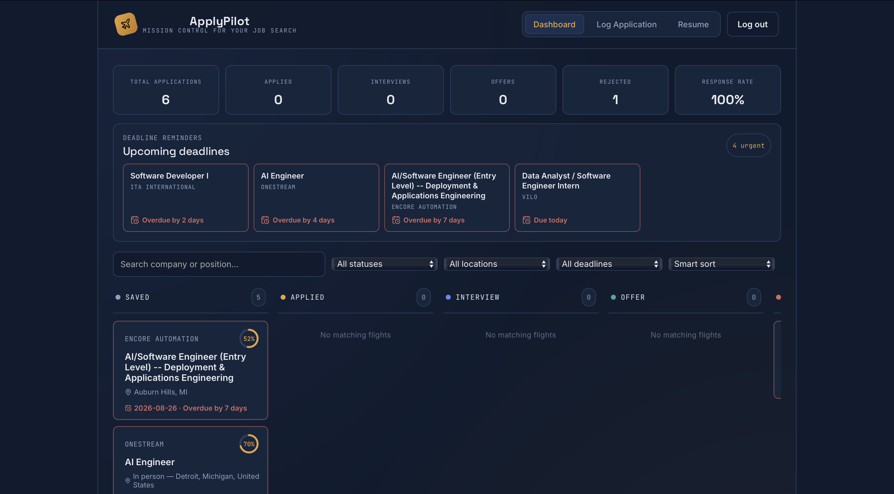
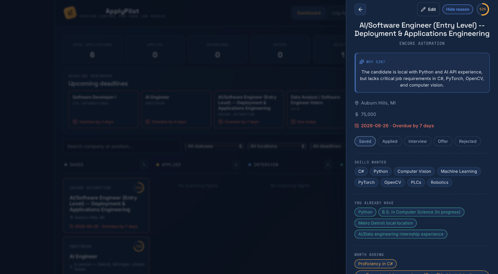
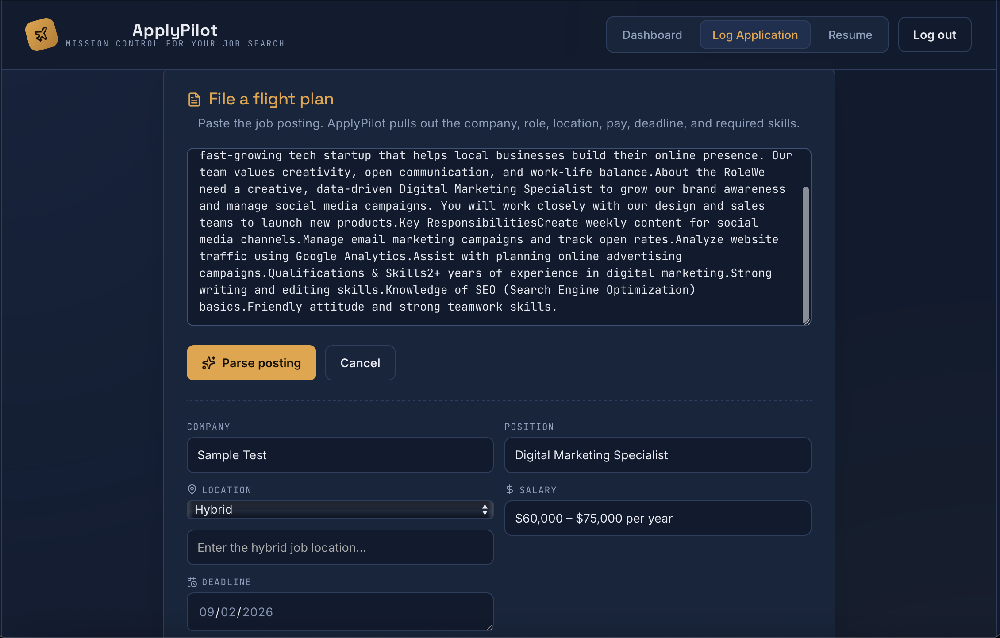
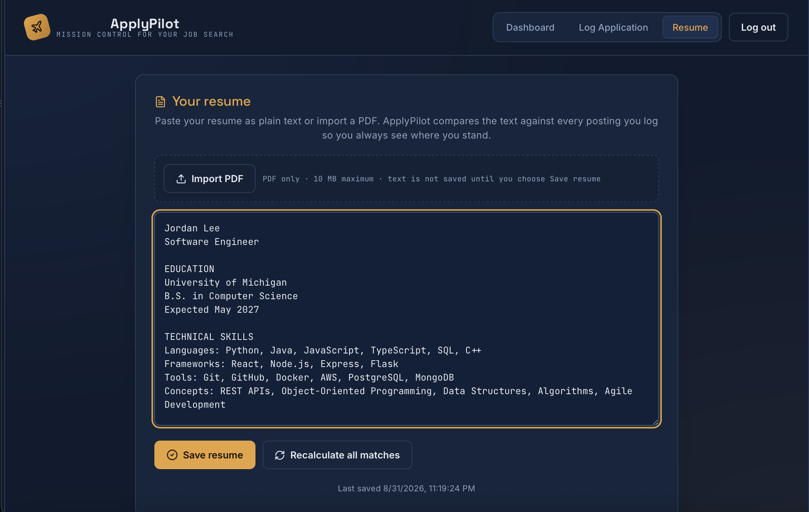
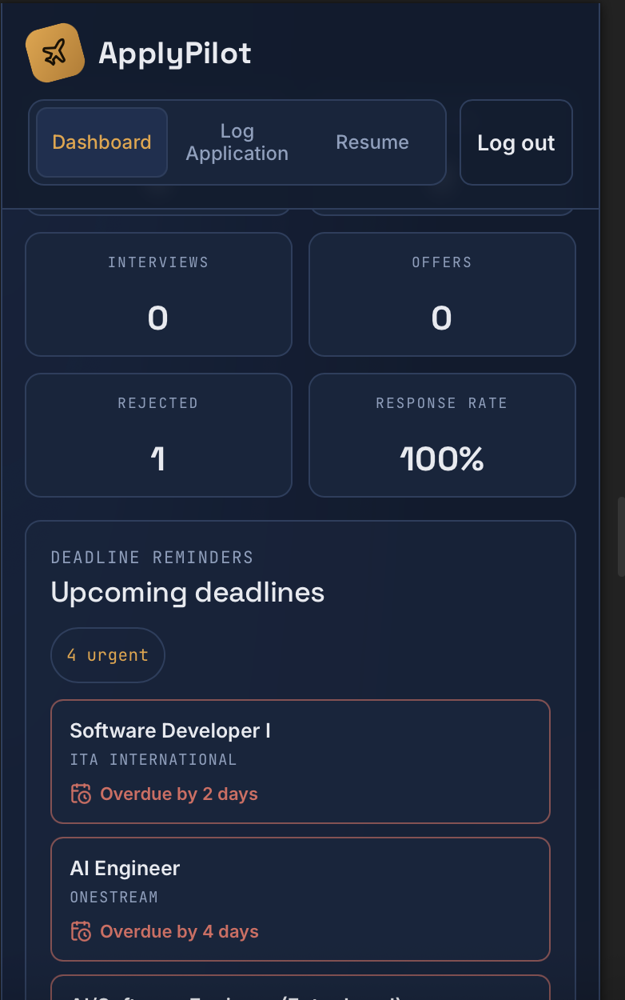

# ApplyPilot

ApplyPilot is a responsive job application tracker that combines a mission-control workflow with AI-assisted job parsing, resume matching, and interview preparation.

## Live demo

**Production URL:** https://apply-pilot-mu.vercel.app

## Screenshots

### Dashboard



*Track application activity, upcoming deadlines, and progress across the hiring pipeline.*

### Application details and AI match analysis



*Review role details, AI-assisted match analysis, resume recommendations, and interview preparation.*

### Log Application



*Paste a job posting to extract structured role information and compare it with a saved resume.*

### Resume and PDF import



*Import a text-based PDF or edit resume text manually before saving and recalculating matches.*

### Mobile dashboard



*Use the core dashboard and application workflow from a responsive mobile layout.*

## Key features

- Email/password authentication, link-based email confirmation, password recovery, and protected user data through Supabase
- Persistent application and resume storage scoped to each user
- Saved, Applied, Interview, Offer, and Rejected application workflow
- AI-assisted extraction of company, role, location, salary, deadline, and skills from pasted job postings
- Resume-to-job match scores with a concise explanation of the result
- Supported qualifications, missing qualifications, and truthful resume-improvement suggestions
- Editable plain-text resume with browser-side PDF text extraction through PDF.js
- Bulk match recalculation with progress, retry handling, and per-application failure recovery
- Search, status/location/deadline filters, and multiple sorting options
- Dashboard statistics, response-rate tracking, and upcoming deadline reminders
- Application editing, deletion confirmation, and duplicate-application checks
- Role-specific AI-generated interview questions
- In-app AI product help with bounded, non-persistent chat history
- Automatic Gemini retries with exponential backoff and safe error messages
- Responsive desktop, tablet, and mobile layouts
- Offline awareness, loading feedback, friendly errors, and toast notifications

## Tech stack

### Frontend

- React 19
- Vite
- Lucide React

### Backend and AI

- Node.js
- Express
- Google Gemini API through `@google/genai`

### Database and authentication

- Supabase
- `@supabase/supabase-js`

### Deployment

- Vercel, using a serverless Gemini API handler in production

### PDF processing

- PDF.js through `pdfjs-dist` for browser-side resume text extraction

## How it works

1. A user creates an account and adds a resume by pasting text or importing a text-based PDF.
2. The user pastes a job posting into the Log Application view.
3. Gemini extracts structured job details from the posting.
4. If a resume is saved, Gemini compares its evidence with the job requirements.
5. The application, match analysis, and workflow status are persisted in Supabase.
6. The dashboard tracks applications, deadlines, match results, recommendations, and progress through the hiring pipeline.

## AI matching

The matching prompt evaluates evidence in the saved resume against:

- Required technical skills and tools
- Relevant responsibilities, projects, and domain experience
- Education and experience requirements
- Preferred qualifications and transferable experience

Gemini returns a match score, supported qualifications, important gaps, up to two resume suggestions, and a short explanation. The score is an AI-assisted estimate intended to support review and prioritization; it is not an objective hiring prediction.

## Project architecture

```text
applypilot/
├── src/
│   ├── App.jsx          # Main React UI, state, Supabase persistence, and AI workflows
│   ├── pdfText.js       # Browser-side PDF.js setup and resume text extraction
│   ├── supabase.js      # Supabase browser client
│   └── main.jsx         # React application entry point
├── api/
│   ├── _lib/             # Shared retry, error, and help-chat utilities
│   ├── gemini.js         # Vercel serverless job/resume AI endpoint
│   └── help-chat.js      # Vercel serverless in-app help endpoint
├── server/
│   └── server.js        # Local Express Gemini API server
├── public/              # Static application assets
└── vite.config.js       # Vite configuration
```

Supabase provides authentication plus persistent `Applications` and `Resumes` data. Database schema and row-level security configuration are managed in Supabase and are not currently included as repository migrations.

## Local development

### Prerequisites

- A current Node.js LTS release
- npm
- A Supabase project with compatible application/resume tables and row-level security
- A Google Gemini API key

### 1. Clone and install the frontend

```bash
git clone https://github.com/evaneshak/ApplyPilot.git
cd ApplyPilot
npm install
```

### 2. Configure frontend environment variables

Create `.env.local` in the project root:

```dotenv
VITE_SUPABASE_URL=https://your-project.supabase.co
VITE_SUPABASE_PUBLISHABLE_KEY=your_supabase_publishable_key
VITE_APP_URL=http://localhost:5173
```

Only use a Supabase browser-safe publishable key in variables prefixed with `VITE_`. Access to user data should be enforced with Supabase row-level security.

### 3. Install and configure the local API server

```bash
cd server
npm install
```

Create `server/.env`:

```dotenv
GEMINI_API_KEY=your_gemini_api_key
PORT=3001
```

### 4. Start both development processes

From `server/`, start the local API:

```bash
node server.js
```

In a second terminal, from the project root, start Vite:

```bash
npm run dev
```

The frontend uses Vite's default development URL, `http://localhost:5173`. In development it sends Gemini and help-chat requests to the local API at `http://localhost:3001`.

### Supabase authentication setup

ApplyPilot currently uses Supabase's standard confirmation-link signup flow. In the Supabase dashboard:

1. Open **Authentication → Providers → Email** and keep **Confirm email** enabled.
2. Keep the default **Authentication → Email Templates → Confirm signup** link template that uses `{{ .ConfirmationURL }}`.
3. Open **Authentication → URL Configuration**. Set **Site URL** to the production ApplyPilot origin and add the production and local password-reset URLs to **Redirect URLs**, for example:

   ```text
   https://apply-pilot-mu.vercel.app/?reset=1
   http://localhost:5173/?reset=1
   ```

New users confirm their account through the Supabase email link, then return to the configured Site URL. The explicit redirect URLs are used by password-reset emails.

### Available frontend commands

```bash
npm run dev      # Start the Vite development server
npm run build    # Create a production build
npm run lint     # Run Oxlint
npm test         # Run retry, error-normalization, and chat-limit tests
npm run preview  # Preview the production build locally
```

## Production environment

The Vercel deployment requires these environment variables:

```text
VITE_SUPABASE_URL
VITE_SUPABASE_PUBLISHABLE_KEY
VITE_APP_URL
GEMINI_API_KEY
```

Set `VITE_APP_URL` to the deployed origin (currently `https://apply-pilot-mu.vercel.app`) so password-reset links always return to production. `GEMINI_API_KEY` remains server-side; do not create a `VITE_GEMINI_API_KEY` variable.

Production frontend requests use the serverless endpoint at `api/gemini.js`; the Gemini key remains server-side.

## Security notes

- Never commit `.env`, `.env.local`, API keys, access tokens, or passwords.
- Keep `GEMINI_API_KEY` server-side and out of browser-exposed `VITE_` variables.
- Use only Supabase browser-safe keys in the frontend.
- Configure Supabase row-level security so users can access only their own applications and resume.
- Treat AI-generated parsing and match analysis as assistance that should be reviewed by the user.

## Project status

ApplyPilot is a functional, deployed portfolio project with authenticated persistence, AI-assisted workflows, PDF resume import, responsive layouts, and production-oriented error handling.

## Potential future improvements

- Multiple resume profiles for different role types
- Additional job-search analytics
- Optional calendar or notification integrations for deadlines
